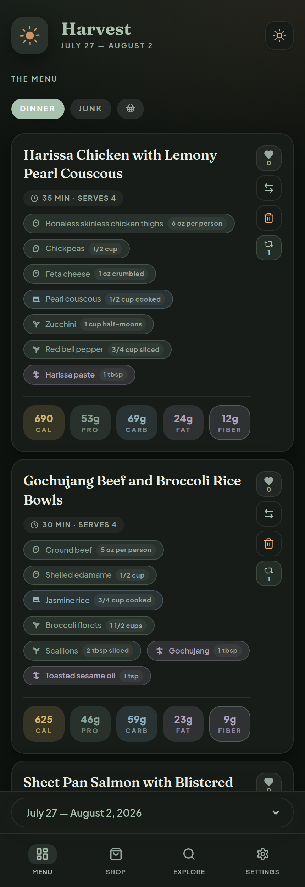

# Harvest

**A two-store meal planner that solves the question "What's for dinner?"**

We shop Sprouts about twice a week and Costco about once a month. Costco is where the
meat, the freezer stock, and the paper goods come from. Sprouts is where everything fresh
comes from — and honestly we buy roughly the same thing every time: turkey for sandwiches,
cheese, lettuce, flax seed brownies.

So breakfast and lunch were solved. **Dinner was not.** That's the part that turns into
"I don't know, what do you want?" at 6pm, which turns into going out.

Harvest plans the dinners. It gives each one a real recipe with numbered steps, derives a
shopping list from the ingredients, and splits that list into a weekly Sprouts run and a
monthly Costco run — each ordered the way you actually walk that store. The staples you
never re-decide ride along automatically.

> This is a fork of [tjs-meal-planner](https://github.com/SGShuman/tjs-meal-planner),
> which was built around a single weekly Trader Joe's trip. The original idea, and the
> week-as-markdown authoring flow, are theirs.



<p align="center">
  <a href="#quick-start"><strong>Quick start</strong></a> ·
  <a href="#updating">Updating</a> ·
  <a href="#what-you-get">Features</a> ·
  <a href="#making-it-yours">Make it yours</a> ·
  <a href="#authoring-a-week">Author a week</a> ·
  <a href="#project-layout">Layout</a> ·
  <a href="#license">License</a>
</p>

---

## Why Harvest

Most meal apps optimize for recipes. Harvest optimizes for **how you actually shop**:

- **Two stores, two rhythms.** A weekly fresh run and a monthly bulk run, each with its
  own walking order. Meat routes to the warehouse list; produce routes to the weekly one.
- **Recurring staples.** The turkey, cheese, lettuce, and paper towels you buy every time
  are configured once and appear on every list.
- **Dinners with recipes.** Numbered steps, prep and cook time, servings, and equipment —
  on the meal card and the detail page.
- **A questionnaire you both fill out.** Separate profiles for each of you — likes,
  dislikes, allergies, goals — merged into rules the planner follows. If one of you can't
  eat something, it never gets planned.
- **A flat menu, no day grid.** Four dinners a week; you decide on Tuesday what Tuesday is.
- **Macros that matter in practice** — calories, protein, carbs, fat, and fiber.
- **Your rules, in the app.** Week shape and dietary targets live at `/settings`, not in
  someone else's config file.

It also ships with markdown + JSON tooling so you (or an AI assistant) can draft a week,
validate it, and publish it into the live app.

> **Note:** Sprouts and Costco are trademarks of their respective owners. This project is
> independent and not affiliated with, endorsed by, or sponsored by either.

## What you get

| Surface | What it does |
|---|---|
| **Menu** (`/menu`) | The week's meals by type, plus Junk and Staples tabs |
| **Shop** (`/shop`) | Derived shopping list, split into Sprouts and Costco tabs in store walking order |
| **Explore** (`/explore`) | Searchable meal library with hearts and history |
| **Questionnaire** (`/onboarding`) | Each person's likes, dislikes, allergies, and goals |
| **Settings** (`/settings`) | Week shape and dietary targets |
| **Offline-friendly** | Service worker keeps the current week usable in-store |

Under the hood: Next.js App Router, React, TypeScript, Tailwind, PostgreSQL, Docker.

## Prerequisites

**Docker Engine + the Compose plugin, on Linux.** Install from Docker's official
repository rather than your distro's `docker.io` package — the distro builds are usually
old and often ship Compose v1:

- [Debian / Ubuntu](https://docs.docker.com/engine/install/ubuntu/)
- [Fedora](https://docs.docker.com/engine/install/fedora/)
- [Other distros](https://docs.docker.com/engine/install/)

Then add yourself to the `docker` group so you are not typing `sudo` all day:

```bash
sudo usermod -aG docker "$USER"
newgrp docker            # or just log out and back in
docker compose version   # should print v2.x
```

Node.js 20+ is only needed if you want to author weeks from the command line. Running the
app needs nothing but Docker.

## Quick start

The published image carries its own database migrations, so a compose file and a `.env`
are the whole install. No clone, no build toolchain.

### 1. Make a directory and grab the two files

```bash
mkdir -p ~/harvest && cd ~/harvest

curl -O https://raw.githubusercontent.com/BeastlyHobo/meal-planner/main/docker-compose.yml
curl -o .env https://raw.githubusercontent.com/BeastlyHobo/meal-planner/main/.env.example
```

### 2. Set a database password

```bash
${EDITOR:-nano} .env      # set POSTGRES_PASSWORD to something real
```

Compose refuses to start without it. Nothing else in `.env` needs changing.

### 3. Start it

```bash
docker compose up -d
docker compose logs -f app     # ctrl-C once you see the migrations finish
```

First start pulls the image, waits for Postgres to report healthy, applies the schema, and
serves. You should see:

```
[migrate] applying 3 migrations
[migrate] applied 001_init.sql
...
[migrate] done
```

Open **http://<your-server>:3000** from any device on your network. A fresh install opens
the questionnaire; after that it goes straight to the menu.

### 4. Load the sample week

```bash
curl -X POST http://localhost:3000/api/mealplan/seed
```

Or use the **Seed plan** control in the UI. You should get four dinners with recipes and a
Shop screen split into Sprouts and Costco tabs.

## Updating

```bash
cd ~/harvest
docker compose pull
docker compose up -d
```

That is the whole update. The app applies any new migrations on start — check
`docker compose logs app` if you want to watch it happen. Your data lives in a named
Docker volume and is not touched by a pull.

To pin a specific version instead of tracking `latest`, set `HARVEST_TAG=v1.2.0` in `.env`.

### Back up first

Worth doing before an update, and worth putting in a cron job:

```bash
docker compose exec -T db pg_dump -U harvest harvest_db | gzip > harvest-$(date +%F).sql.gz
```

Restore into a fresh stack:

```bash
gunzip -c harvest-2026-07-27.sql.gz | docker compose exec -T db psql -U harvest -d harvest_db
```

(Use your own `POSTGRES_USER` / `POSTGRES_DB` if you changed them.)

### Stop / reset

```bash
docker compose down          # stop, keep data
docker compose down -v       # also wipe the database volume
```

## A word on security

**There is no login.** Every mutating API route is open to anything that can reach port
3000, and `/api/*` responds with `Access-Control-Allow-Origin: *`. That is a deliberate
trade for a household app on a home network — it means no password to share with your
spouse and no session to expire while you are standing in an aisle.

It also means: **do not port-forward this, and do not put it on a public IP.** On a normal
home LAN behind a router it is fine. If you want it reachable from outside the house, put
it behind a VPN (Tailscale, WireGuard) or a reverse proxy that does the authenticating.

Postgres is not published to the host at all — only the app container can reach it.

## Running from source

Only needed if you are changing the code.

Build and run the production stack from your checkout:

```bash
git clone https://github.com/BeastlyHobo/meal-planner.git
cd meal-planner
cp .env.example .env      # set POSTGRES_PASSWORD
docker compose -f docker-compose.yml -f docker-compose.build.yml up -d --build
```

### Development stack (hot reload)

```bash
docker compose -f docker-compose.dev.yml up -d --build
```

This one publishes Postgres on `localhost:5432` so host-side scripts can reach it:

```bash
npm install
npm run seed:meal-plan
npm run lint
npm run test:meal-plan-tools
```

### Publishing your own image

`.github/workflows/publish.yml` runs lint, typecheck, and tests, then builds and pushes to
`ghcr.io/beastlyhobo/meal-planner`. It publishes `latest` from `main`, a `sha-` tag on
every build, and `vX.Y.Z` + `X.Y` when you push a `v*` git tag. Authentication uses the
built-in `GITHUB_TOKEN` — there is nothing to configure.

If you fork this, change `IMAGE_NAME` in that workflow and the `image:` line in
`docker-compose.yml` to your own lowercase `owner/repo`.

> **One-time, after the first successful publish:** a new GHCR package is private by
> default. Make it public at
> `github.com/users/<owner>/packages/container/meal-planner/settings` — otherwise your
> server needs `docker login ghcr.io` before it can pull.

## Making it yours

This is the part worth doing before your first real week.

### 1. Your store layouts

`lib/stores/sprouts.ts` and `lib/stores/costco.ts` each export a zone array — the order
you physically walk that store. Reorder it to match yours and the Shop screen follows
immediately. The keyword rules below each array decide which aisle an item lands in; add
terms when something classifies wrong.

Documented in [`data/shopping-areas.md`](data/shopping-areas.md).

### 2. Which store buys what

`lib/stores/routing.ts` decides whether an item is a weekly or a bulk purchase. By default
Costco claims raw meat, freezer stock, paper and cleaning goods, and large-format pantry
staples; everything else goes to Sprouts. Any ingredient can override this with
`"store": "costco"` or `"store": "sprouts"`.

### 3. Your staples

`STAPLES_CATALOG` in `lib/constants.ts` is the list of things you buy without
re-deciding, each tagged with its store. Edit it to match your kitchen. The Staples tab on
the Menu screen manages which ones are on a given week.

### 4. Your tastes

Run the questionnaire at **`/onboarding`** — it opens automatically on a fresh install.
Each person answers separately: foods you love, foods you'd rather not, hard nos,
allergies, cuisines you want more of, and what you're going for.

Every list takes **taps or typing**. Chips cover the foods households actually argue about
— mushrooms, cilantro, blue cheese, spicy — and the text box next to them takes anything
they don't, so you're never limited to a vocabulary someone else picked. Both edit the
same list: tapping a selected chip removes it, and typing a word that matches a chip
lights that chip up. Edit the catalogs in `lib/settings/suggestions.ts`.

Then it merges the two profiles and shows you the result before saving:

| Bucket | What it means |
|---|---|
| **Never used** | One of you is allergic to it or refuses it. Never planned, no exceptions — and it's dropped from the other person's "loves" too. |
| **You both love** | Featured often. |
| **One of you loves** | Rotated in rather than every week. |
| **You disagree** | Planned occasionally, and built so it's easy to leave out. |

Picking a goal ("more protein", "stop eating out") shows you the concrete target change —
*Protein floor 30g → 40g* — behind an Apply button. Nothing changes silently.

### 5. Your week shape and targets

Go to **`/settings`**. Set how many breakfasts, lunches, dinners, and snacks a week
contains (the default is four dinners and nothing else), plus your calorie window, protein
and fiber floors, cook-time ceiling, and servings per dinner. Defaults live in
`lib/settings/index.ts`.

These drive the plan validator and the planning brief — they are not decoration. The
questionnaire's hard nos land in the **Never use** list here, which is additive: you can
add to it, but removing someone's allergy means editing their profile, not this field.

## Authoring a week

Harvest treats a week as a markdown file with a fenced JSON block (see
[`data/current-week.md`](data/current-week.md) for a complete worked example).

```bash
# Scaffold a new week
npm run meal-plan -- new 2026-08-03

# Edit it (keep the JSON fence valid), then:
npm run meal-plan -- validate data/mealplans/mealplan-week-2026-08-03.md
npm run meal-plan:sync      # validate + write data/current-week.json
npm run meal-plan:publish   # upsert into Postgres
```

Validation checks meal counts against your settings, macro sums, duplicate bases and
engines, recipe completeness on dinners, junk categories, and shopping classification —
then prints the derived list grouped by store so you can eyeball the walk order.

### Planning context (great for AI-assisted weeks)

| File | Role |
|---|---|
| [`data/diner-preferences.md`](data/diner-preferences.md) | What a good week looks like beyond the numbers |
| [`data/companion-preferences.md`](data/companion-preferences.md) | Junk-list categories and rotation rules |
| [`data/data_context.md`](data/data_context.md) | Ingredient guidance, recipe-writing rules, data schema |
| [`data/meal-plan-skill.md`](data/meal-plan-skill.md) | AI/CLI week-authoring skill + JSON scaffold |
| [`data/MEAL_PLAN_PRODUCTION_WORKFLOW.md`](data/MEAL_PLAN_PRODUCTION_WORKFLOW.md) | End-to-end publish checklist |
| [`data/shopping-areas.md`](data/shopping-areas.md) | Store layouts and routing rules |

Preferences are **not** in these files — they come from `GET /api/settings`, whose
`brief` field renders both people's profiles and the reconciliation as prose:

```bash
curl -s http://localhost:3000/api/settings | jq -r .data.brief
npm run settings:brief   # same thing from a terminal, needs DATABASE_URL
```

With a reachable database, `npm run meal-plan -- validate` checks a week against those
live preferences — so a dinner containing something one of you can't eat gets flagged.

## Project layout

```text
app/                 Next.js routes + API handlers
components/          UI (menu cards, shop list, modals, nav)
lib/                 Domain logic, DB access, hooks, providers
lib/stores/          Store layouts, aisle rules, and store routing
lib/settings/        Week shape, dietary targets, people, goal presets, chip catalogs
db/init/             Postgres schema and migrations, applied on container start
scripts/             Seed / sync / publish / validation tools + migrate.mjs
data/                Sample week, preferences, planning docs
docs/                Screenshots and public assets for the README
.github/workflows/   Checks and the GHCR image publish
```

| File | When you use it |
|---|---|
| `docker-compose.yml` | Normal operation. Pulls the published image. |
| `docker-compose.build.yml` | Overlay to build from your checkout instead. |
| `docker-compose.dev.yml` | Hot-reload development. |

## Scripts

| Command | What it does |
|---|---|
| `npm run seed:meal-plan` | Upsert `data/current-week.json` into Postgres |
| `npm run meal-plan:sync` | Validate markdown → rewrite JSON |
| `npm run meal-plan:publish` | Publish the synced week to the database |
| `npm run meal-plan:bootstrap-markdown` | Rebuild `current-week.md` from JSON |
| `npm run meal-plan` | CLI wrapper (`new` / `validate` / `publish`) |
| `npm run settings:brief` | Print the household planning brief |
| `npm run db:migrate` | Apply pending `db/init/*.sql` (the container does this itself on start) |
| `npm run test:shopping` | Store layout and routing unit checks |
| `npm run test:meal-plans` | Meal-plan fixture validation |
| `npm run test:settings` | Preference reconciliation and goal presets |
| `npm run test:meal-plan-tools` | Run all three test suites |
| `npm run lint` | ESLint |

Host-side DB scripts expect `DATABASE_URL` (see `.env.example`). Use the **dev** Compose
file, or point `DATABASE_URL` at a reachable Postgres.

## API overview

| Method | Path | Purpose |
|---|---|---|
| `GET` | `/api/mealplan` | Latest or selected week (+ available weeks) |
| `POST` | `/api/mealplan/seed` | Seed from `data/current-week.json` |
| `PATCH` | `/api/mealplan/meals` | Swap / add / remove menu slots |
| `POST` | `/api/mealplan/ratings` | Heart a meal |
| `*` | `/api/mealplan/shopping` | Shopping list updates |
| `*` | `/api/mealplan/junk` | Junk list updates |
| `*` | `/api/mealplan/staples` | Staples list updates |
| `GET`/`POST` | `/api/meals` | Meal library |
| `PUT` | `/api/meals/[id]` | Update a meal |
| `GET`/`PUT` | `/api/settings` | Week shape, dietary rules, people, and the rendered `brief` |
| `GET` | `/api/health` | Liveness + database reachability (used by the container healthcheck) |

**Security:** see [A word on security](#a-word-on-security). Mutating routes are
unauthenticated by design; keep this on your LAN.

## How migrations work

`scripts/migrate.mjs` runs before the server on every container start. It records applied
files in a `schema_migrations` table, takes an advisory lock so two containers cannot race,
and runs each pending file from `db/init/` in its own transaction.

This exists because Postgres only runs `/docker-entrypoint-initdb.d` when its data
directory is empty — without it, pulling a newer image would leave an existing database on
the old schema.

Adopting a database that predates this is safe: with no `schema_migrations` table every
file replays, and every file in `db/init/` is written to be idempotent
(`CREATE ... IF NOT EXISTS`, `ADD COLUMN IF NOT EXISTS`, guarded `UPDATE`). On a current
database that is a no-op; on one stuck mid-upgrade it is a repair.

Writing a new one: add `db/init/00N_description.sql`, keep it idempotent, and never edit a
file that has already shipped — it will not re-run on databases that recorded it.

## Troubleshooting

| Symptom | Likely fix |
|---|---|
| `POSTGRES_PASSWORD` error on `docker compose up` | Copy `.env.example` → `.env` and set a password |
| `denied` / `unauthorized` on `docker compose pull` | The GHCR package is still private — make it public in the package settings, or `docker login ghcr.io` |
| App is up but Menu is empty | `curl -X POST http://localhost:3000/api/mealplan/seed` |
| App container keeps restarting | `docker compose logs app` — a failed migration exits non-zero on purpose rather than serving a half-migrated schema |
| Can't reach it from your phone | Use the server's LAN IP, not `localhost`, and check the host firewall allows 3000 |
| An item shows up in the wrong aisle | Add a keyword rule in `lib/stores/sprouts.ts` or `lib/stores/costco.ts` |
| An item shows up at the wrong store | Set `"store"` on the ingredient, or edit `lib/stores/routing.ts` |
| Settings page always shows defaults | Migrations have not run — check `docker compose logs app` |
| The questionnaire keeps reappearing on launch | It only stops once you finish it or hit **Skip for now**; both write `completedOnboardingAt` |
| Removing an allergy from Settings doesn't stick | By design — edit that person at `/onboarding` |
| `npm run seed:meal-plan` can't connect | Use `docker-compose.dev.yml` (Postgres on `5432`) or fix `DATABASE_URL` |
| Stale UI after an update | Hard-refresh. The service worker caches the shell; a reload picks up the new one |
| Port 3000 already in use | Stop the other process, or change the host mapping in Compose |

## Contributing

Issues and PRs welcome. Keep the shopping-derivation and store-routing tests green:

```bash
npm run lint
npm run test:meal-plan-tools
```

## License

MIT — see [LICENSE](LICENSE).
